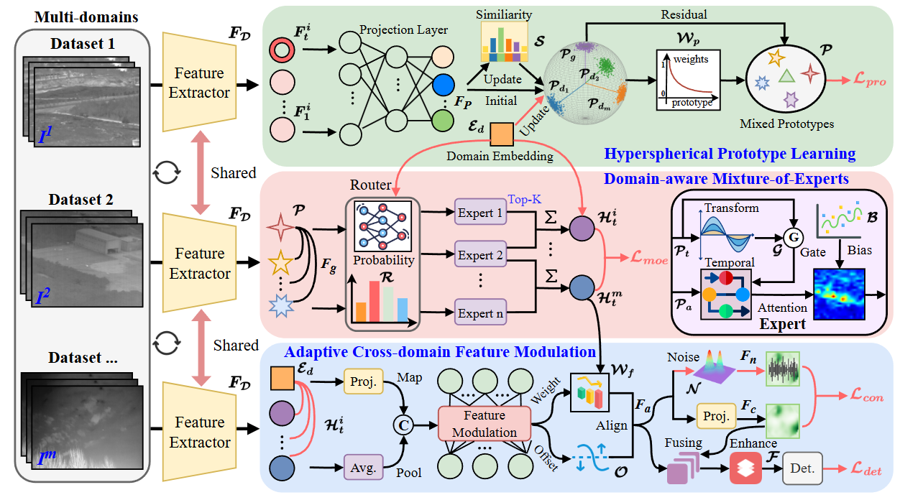
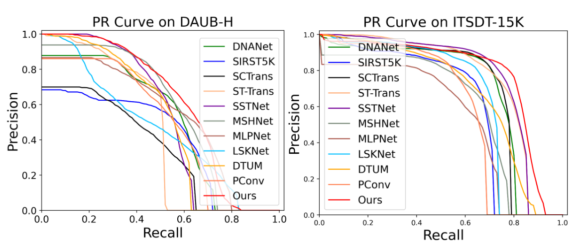
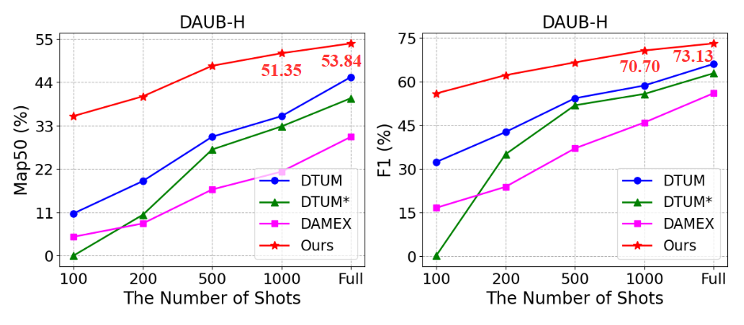

# CoMoE
**[AAAI 26] Cross-domain Joint Learning with Prototype-guided Mixture-of-Experts for Infrared Moving Small Target Detection**



## Introduction
Infrared small target detection often faces significant domain gaps across datasets due to varying sensors and scene distributions. Currently, most existing methods are typically based on single-domain learning (i.e., training and test are on the same dataset), requiring training separate detectors when considering different datasets. However, they overlook the valuable public knowledge across domains and limit the applicability in multiple infrared scenarios. To break through single-domain learning, implementing only one universal detector simultaneously on multiple datasets, as the first exploration, we propose a cross-domain joint learning task framework with prototype-guided Mixture-of-Experts (CoMoE). Specifically, it designs a hyperspherical prototype learning to adaptively maintain both domain-specific prototypes and global prototypes, enhancing cross-domain feature representation. Meanwhile, a domain-aware Mixture-of-Experts with Top-K routing strategy is proposed to assign the optimal domain experts. Moreover, to enhance cross-domain feature alignment, we design an adaptive cross-domain feature modulation with noise-guided contrastive learning. The extensive experiments on a newly constructed benchmark comprising three datasets verify the superiority of our CoMoE, even under limited data settings. It could often surpass general joint learning methods, and state-of-the-art (SOTA) single-domain ones. 

## Prerequisite
- scipy==1.10.1
- numpy==1.24.4
- matplotlib==3.7.5
- opencv_python==4.9.0.80
- torch==2.0.0+cu118
- torchvision==0.12.0
- pycocotools==2.0.7
- timm==0.9.16
- pyhton==3.8.19
- Tested on Ubuntu 22.04.6, with CUDA 12.0, and 1x NVIDIA 4090(24 GB)

## Datasets (bounding box-based)
- Datasets are available at [DAUB-H](https://pan.baidu.com/s/18hq2ArrOSNoFh0Nq0u-ZlA) (code: xkps), [ITSDT-15K](https://drive.google.com/file/d/1nnlXK0QCoFqToOL-7WdRQCZfbGJvHLh2/view?usp=sharing) and [IRDST-R](https://pan.baidu.com/s/1XRiP6nhWgzy8Cn0i-EssVA) (code: kt4d). DAUB-H is the hard version of DAUB, IRDST-R is the reconstruced version of IRDST.
- You need to reorganize these datasets in a format similar to the `coco_train_multi.txt` and `coco_val_multi.txt` files we provided (`.txt files` are used in training).  We provide the `.txt files` for ITSDT-15K, DAUB-R and IRDST-H.
  For example:

```python
train_annotation_path = '/home/public/coco_train_multi.txt'
val_annotation_path = '/home/public/coco_val_multi.txt'
```
- The folder structure should look like this:

```
- coco_train_multi.txt
- coco_val_multi.txt
ITSDT
├─instances_train2017.json
├─instances_test2017.json
├─coco_train_ITSDT.txt
├─coco_val_ITSDT.txt
├─images
│   ├─1
│   │   ├─0.bmp
│   │   ├─1.bmp
│   │   ├─2.bmp
│   │   ├─ ...
│   ├─2
│   │   ├─0.bmp
│   │   ├─1.bmp
│   │   ├─2.bmp
│   │   ├─ ...
│   ├─3
│   │   ├─ ...
```

## Usage of CoMoE
### Train
- Note: Please change settings for different datasets, including the txt files, and image paths. Besides, you should load the pretrained model weights for further training.
```
CUDA_VISIBLE_DEVICES=0 python train.py
```
### Test

- Usually `best_model.pth` is not necessarily the best model. Peease try different models for verification.

```python
"model_path": './logs/model.pth'
```

- You need to change the path of the `json file` of test sets. For example:

```python
# Use ITSDT-15K dataset for test

cocoGt_path         = '/home/public/ITSDT-15K/instances_test2017.json'
dataset_img_path    = '/home/public/ITSDT-15K/'
```

```python
python test.py
```

### Visulization

- We support `video` and `single-frame image` prediction.

```python
# mode = "video" (predict a sequence)

mode = "predict"  # Predict a single-frame image 
```

```python
python predict.py
```

## Results
- For bounding box detection, we use COCO's evaluation metrics: [model weights](https://drive.google.com/file/d/1l9LN-6LqMXlTfthOP15Uy5959xuOnhzF/view?usp=drive_link)

| Method  | Dataset     | mAP50 (%) | Precision (%) | Recall (%) | F1 (%)  | Setting          |
|---------|-------------|-----------|---------------|------------|---------|------------------|
| CoMoE   | DAUB-H      | 53.84     | 71.15         | 75.22      | 73.13   |                  |
| CoMoE   | ITSDT-15K   | 78.19     | 85.77         | 92.78      | 89.14   | Joint Learning   |
| CoMoE   | IRDST-R     | 69.47     | 80.15         | 88.28      | 84.02   |                  |



- Even under limited data settings, CoMoE outperforms general joint learning methods, and SOTA single-domain ones.



## Contact
IF any questions, please contact with Weiwei Duan via email: [dwwuestc@163.com]().

## Reference
1. W. Duan, L. Ji, S. Chen, S. Zhu and M. Ye, "Triple-Domain Feature Learning With Frequency-Aware Memory Enhancement for Moving Infrared Small Target Detection," in IEEE Transactions on Geoscience and Remote Sensing, vol. 62, pp. 1-14, 2024, Art no. 5006014, doi: 10.1109/TGRS.2024.3452175.
2. Bingwei Hui, Zhiyong Song, Hongqi Fan, et al. A dataset for infrared image dim-small aircraft target detection and tracking under ground / air background[DS/OL]. V1. Science Data Bank, 2019[2024-12-10]. https://cstr.cn/31253.11.sciencedb.902. CSTR:31253.11.sciencedb.902.
3. Ruigang Fu, Hongqi Fan, Yongfeng Zhu, et al. A dataset for infrared time-sensitive target detection and tracking for air-ground application[DS/OL]. V2. Science Data Bank, 2022[2024-12-10]. https://cstr.cn/31253.11.sciencedb.j00001.00331. CSTR:31253.11.sciencedb.j00001.00331.


